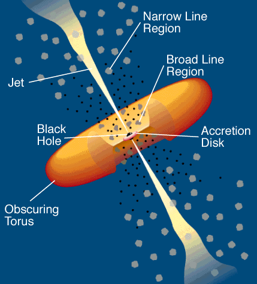
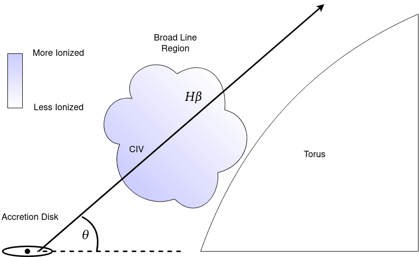
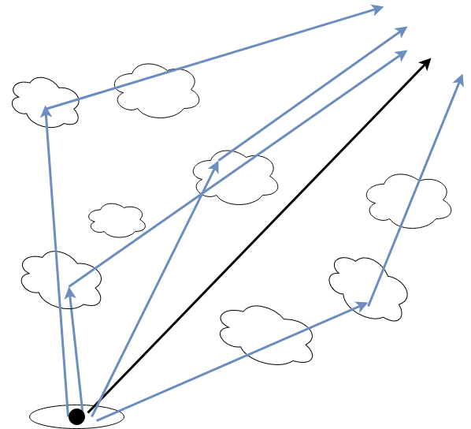

```{r setup, include=FALSE}
knitr::opts_chunk$set(echo = TRUE)
```


# Theory

## Background Info

Quasars are the most luminous objects in the universe. They're so bright that we can observe light from quasars that was emitted over 10 billion years ago. Quasars form when a supermassive black hole at the center of a galaxy draws gas from its host forming a disk that accretes onto the black hole. This disk emits thermal radiation that outshines the entire host galaxy. A diagram is given below.

{width=300, height=400px}

The broad line region contains clouds of gas orbiting the supermassive black hole with Keplerian velocities. This gas is illuminated by the continuum from the accretion disk and manifests itself through emission lines in quasar spectra.

Quasars have been observed to have significant variability in their continua. Because the broad line region is illuminated by the continuum source, variability in the continuum will cause variability in the emission lines. However, the variability in the emission lines will lag behind the variability in the continuum source, as it takes light time to travel from the accretion disk to the broad line region. By probing the time lag between the variability in the continuum and the variability in the emission lines, we can derive an estimate for the distance from the accretion disk to the broad line region.

The time delay of the variability ($\tau$) is equal to the average distance (R) divided by the speed of light (c)

$$\tau=\frac{R}{c}$$

In practice we can determine $\tau$ by gathering light curves for the continuum and some emission line and estimating the lag using cross correlation (more on that later).

While we consider the accretion disk to be small enough to ignore variations in the location of the continuum, the same can not be said for the broad line region. I.e we can not treat the broad line region as a single point. In fact, we observe ionization stratification in the broad line region. That is, emission lines with higher ionization potentials will probe radii closer to the accretion disk. The broad line region is more ionized closer to the accretion disk.

{width=400,height=400px}

When we pick out some emission line, like $H\beta$ and use that, along with the continuum, to measure $\tau$, we are measuring the $H\beta$ weighted average light travel time. 

## Transfer Function

If we measure the strength of our emission line over time, L(t), and our continuum over time C(t). We can determine the best lag to model them.

There's a difficulty here though, continuum light travels straight to the observer. The emission light will always take longer to reach the observer than the continuum light, but, depending on where it interacts with the broad line region, it can take any amount of time longer to reach the observer.


{width=300,height=300px}

We can see how there needs to be some term that gives us information about the geometry of the broad line region, otherwise we would have no idea what radius we were probing. We call this term the transfer function, $\Psi(\tau)$, and it's defined such that the emission light curve, L(t), is the convolution of the transfer function and the continuum light curve, C(t)

$$L(t)=\int_{-\infty}^{\infty}\Psi(\tau)C(t-\tau)d\tau$$


We can think of this as the weighted average of the continuum light curve given the geometry of the broad line region. Ideally, the measurement of L(t) and C(t) would allow us to gain some information about the geometry of the broad line region. However, there are many reasons why this ends up being quite difficult (ex. White and Peterson 1994).

In practice the transfer function is often ignored, and it is accepted that black hole masses may be uncertain to a factor of ~ 2. Even considering the transfer function, you would still see a lag value of $\tau=\frac{R}{c}$ for both a thin spherical shell of radius R and a thin ring of radius R at any inclination! (White and Peterson 1994).


## Finding the Lag

In order to compute the lag time we use the cross correlation function. Cross correlation gives a measure of the similarity of two series as a function of the displacement of one relative to the other.

$$F_{CCF}(\tau)=\int_{-\infty}^{\infty}L(t)C(t-\tau)dt$$

Let's examine the CCF for sin(x) and cos(x)

```{r,echo=FALSE}
library(shiny)

shinyAppFile("sincos_shinyapp.R")

```


