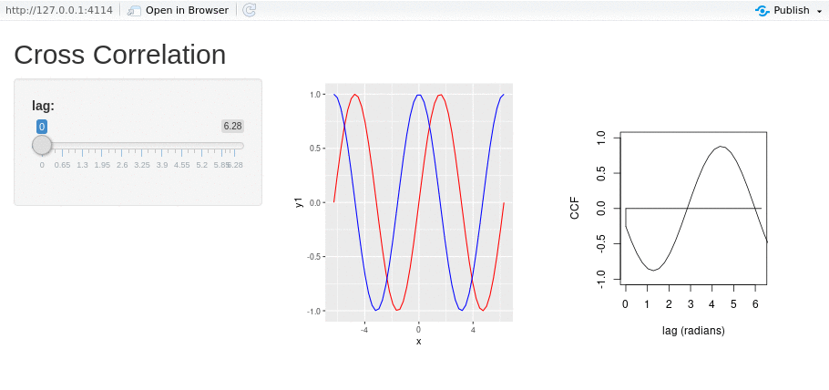

```{r setup, include=FALSE}
knitr::opts_chunk$set(echo = TRUE)
```

# Abstract

There is a well-known strong correlation between the mass of a supermassive black hole and the velocity dispersion of its host galaxy’s bulge, known as the M-$\sigma$ relation. This can not be explained through a direct relationship as the radius of gravitational influence of the black hole is much smaller than the radius of the host galaxy’s bulge. This suggests that there is some other form of feedback between the supermassive black hole and its host galaxy. The source of this feedback is unknown and an area of much active research. One way that these black hole masses are calculated is through reverberation mapping techniques.

The purpose of this computational exercise is to help students understand reverberation mapping. After completion of the project students will understand the purpose of a transfer function, they will be comfortable fitting reverberation mapping data with a time lag, and they will be comfortable fitting emission lines for their velocity width.

The exercise begins with background information on reverberation mapping. Graphics are provided to instill visual understanding of a quasar’s accretion disk and broad line region. Continuum and Hβ light curves are provided, along with an interactive plotting tool that plots the continuum and emission light curves, as well as the cross correlation for different lag values. Once the time lag is extracted, the radius of the broad line region is determined. Next, students will use a spectral fitting tool to fit the rest frame optical spectrum to determine the Keplerian velocity. Once velocity and radius are determined, the black hole mass can be calculated.

# Additional Information

Abbreviated Title: Reverberation Mapping

URL Reference: BLR

Type: Exercise Set

Course/Context: Astronomy/Astrophysics

Course Level: First Year of College, Beyond First Year

Author: Collin Dabbieri

Email: cdabbieri@gmail.com

# Learning Goals

After the completion of this project, students should be able to:

-Calculate the cross correlation function for unevenly sampled time series data

-Fit an emission line to determine its velocity width

-Determine black hole mass estimates for reverberation mapping data


# Background Info

Quasars are the most luminous objects in the universe. They're so bright that we can observe light from quasars that was emitted over 10 billion years ago. Quasars form when a supermassive black hole at the center of a galaxy draws gas from its host forming a disk that accretes onto the black hole. This disk emits thermal radiation that outshines the entire host galaxy. A diagram is given below.

{width=300, height=400px}

The continuum light from the accretion disk emits like the sum of many blackbodies at different temperatures, and in practice is modelled as a power-law. The broad line region is illuminated by the accretion disk and gives off broad emission lines. An example synthetic spectrum is given below.

{width=300, height=400px}


# Galaxy Feedback

There's a well-known correlation between the mass of a galaxy's spheroidal component and the mass of the supermassive black hole at its center. For an elliptical galaxy, the spheroid is the whole galaxy, and for a spiral galaxy the spheroid is the central bulge. A plot illustrating this correlation is given below

{width=300, height=400px}


This is known as the M-$\sigma$ relation. The x-axis is the host galaxy's velocity dispersion, an analogue for its mass. The y-axis is the mass of the supermassive black hole at the center of the host galaxy. This correlation implies some coevolution mechanism between the supermassive black hole and its host galaxy. The source of this mechanism is an important area of active research.

# Reverberation Mapping

One of the ways we can constrain the mass of the supermassive black hole is through AGN reverberation mapping. Because gas in the broad line region orbits the black hole with keplerian velocities, we can use properties of the broad line region to constrain the black hole mass. To achieve this we need to calculate two things, a characteristic radius of the broad line region, and the velocity dispersion of the gas at that radius. If we can constrain these two values, our supermassive black hole mass can be given by the following equation.

$$M_{BH}=f\frac{Rv^2}{G}$$

Where R is the radius of the broad line region and $v$ is the characteristic velocity. $f$ is a parameter that takes in to account things like the inclination of the accretion disc and the geometry of the broad line region. In practice, we are usually not able to constrain these values for an individual quasar, for reasons we'll discuss below, and so average $f$ values are determined. $<f>$ can actually be calculated from the M-$\sigma$ relation above. Reverberation mapping is not the only way to constrain the mass of a supermassive black hole, so we can use the line of best fit for M-$\sigma$ values determined through other means to constrain our $<f>$ for reverberation mapped objects. The next few sections will discuss how we determine the radius and velocity of the broad line region.

## Constraining the Radius

The broad line region contains clouds of gas orbiting the supermassive black hole with Keplerian velocities. This gas is illuminated by the continuum from the accretion disk and manifests itself through emission lines in quasar spectra.

Quasars have been observed to have significant variability in their continua. Because the broad line region is illuminated by the continuum source, variability in the continuum will cause variability in the emission lines. However, the variability in the emission lines will lag behind the variability in the continuum source, as it takes light time to travel from the accretion disk to the broad line region. By probing the time lag between the variability in the continuum and the variability in the emission lines, we can derive an estimate for the distance from the accretion disk to the broad line region.

The time delay of the variability ($\tau$) is equal to the average distance (R) divided by the speed of light (c)

$$\tau=\frac{R}{c}$$

In practice we can determine $\tau$ by gathering light curves for the continuum and some emission line and estimating the lag using cross correlation (more on that later).

While we consider the accretion disk to be small enough to ignore variations in the location of the continuum, the same can not be said for the broad line region. I.e we can not treat the broad line region as a single point. In fact, we observe ionization stratification in the broad line region. That is, emission lines with higher ionization potentials will probe radii closer to the accretion disk. The broad line region is more ionized closer to the accretion disk.

{width=400,height=400px}


### Transfer Function

When we pick out some emission line, like $H\beta$ and use that, along with the continuum, to measure $\tau$, we are measuring the $H\beta$ emission weighted average light travel time. Continuum light travels straight to the observer. The emission light will always take longer to reach the observer than the continuum light, but, depending on where it interacts with the broad line region, it can take any amount of time longer to reach the observer.


{width=300,height=300px}

We can see how there needs to be some term that gives us information about the geometry of the broad line region, otherwise we would have no idea what radius we were probing. We call this term the transfer function, $\Psi(\tau)$, and it's defined such that the emission light curve, L(t), is the convolution of the transfer function and the continuum light curve, C(t)

$$L(t)=\int_{-\infty}^{\infty}\Psi(\tau)C(t-\tau)d\tau$$


We can think of this as the weighted average of the continuum light curve given the geometry of the broad line region. More exactly, the transfer function represents the broad line region's response to a $\delta$ function outburst, as observed from far away. Ideally, the measurement of L(t) and C(t) would allow us to gain some information about the geometry of the broad line region. However, there are many reasons why this ends up being quite difficult (ex. White and Peterson 1994).

In practice the transfer function is often ignored, and it is accepted that black hole masses may be uncertain to a factor of ~ 2. Even considering the transfer function, you would still see a lag value of $\tau=\frac{R}{c}$ for both a thin spherical shell of radius R and a thin ring of radius R at any inclination! (White and Peterson 1994).


### Finding the Lag

In order to compute the lag time, we use the cross correlation function. Cross correlation gives a measure of the similarity of two series as a function of the displacement of one relative to the other.

$$F_{CCF}(\tau)=\int_{-\infty}^{\infty}L(t)C(t-\tau)dt$$

Let's examine the CCF for sin(x) and cos(x)

{width=300,height=300px}

NOTE: I've embedded a gif here because there's some weirdness with sending interactive servers. I.e you wouldn't be able to run the server on your machine without having the r scripts in the same directory and having shiny installed. I can resolve this for the class by hosting the server on shinyapps.io 

```{r,echo=FALSE, eval=FALSE}
library(shiny)

shinyAppFile("sincos_shinyapp.R")

```

The cross correlation function reaches its maximum at a delay of $3\pi/2$, when the two functions are identical. I.e $sin(x)=cos(x-3\pi/2)$. 

We can plot our continuum and emission light curves with a delay and find the lag time with the maximum cross correlation function value. However, we have light curves sampled at discrete times, so we need a discrete version of this cross correlation function.

$$F_{CCF}(\tau)=\frac{1}{N}\sum_{i=i}^N\frac{[L(t_i)-\bar L][C(t_i-\tau)-\bar C]}{\sigma_C \sigma_L}$$

This method assumes evenly sampled time data, which is nearly impossible to achieve, so we can interpolate our light curves onto evenly sampled time intervals. 

```{r,echo=FALSE, eval=FALSE}
library(shiny)

shinyAppFile("lagplot_shinyapp.R")

```

Once we've used the cross correlation function to pick out our ideal lag time, we can determine the radius of the broad line region with 

$$R=\tau c$$

### Real Data


Let's look at some continuum and emission light curves. This data was reported in Grier et al 2012 ApJ 755 60.


```{r}
Continuum=read.table("Mrk335_Continuum.txt")
colnames(Continuum)=c("HJD","Flux")
head(Continuum)
```


```{r}
Emission=read.table("Mrk335_Emission.txt")
colnames(Emission)=c("HJD","FHb")
head(Emission)
```

We'll want to normalize the flux values so they can be properly compared.


```{r}
normalize <- function(x) {
    return ((x - min(x)) / (max(x) - min(x)))
  }
```


```{r}
library(ggplot2)
ggplot()+
  geom_line(aes(HJD,normalize(Flux)),data=Continuum)+
  geom_line(aes(HJD,normalize(FHb)),data=Emission)
```


It's clear visually that these two light curves show similar variability, with some time delay.

Now we can interpolate onto evenly sampled time bins

```{r}
xout=seq(min(Emission$HJD),max(Emission$HJD),length.out=length(Emission$HJD)) #pick evenly sampled x values

temp=approx(Emission$HJD,Emission$FHb,xout) #interpolate emission light curve onto those values
temp=temp$y
FHb_interp=normalize(temp)

temp=approx(Continuum$HJD,Continuum$Flux,xout) #interpolate continuum light curve onto those values
temp=temp$y
Fc_interp=normalize(temp)

ggplot()+
  geom_line(aes(xout,Fc_interp))+
  geom_line(aes(xout,FHb_interp))
```


Now let's make a method for calculating the discrete cross correlation function

$$F_{CCF}(\tau)=\frac{1}{N}\sum_{i=i}^N\frac{[L(t_i)-\bar L][C(t_i-\tau)-\bar C]}{\sigma_C \sigma_L}$$


```{r}

CCF<-function(C,L,x,lagmax){
  
  num_lags=lagmax #moving in intervals of 1
  N=length(C)

  sigmaC=sd(C)
  sigmaL=sd(L)
  Cbar=mean(C)
  Lbar=mean(L)
  
  ccf_out=c()
  lags=c()
  

  for(tau in 1:lagmax){
    
    
    count=0 #for normalization
    sum=0

    for(i in (tau+1):N){ #we have to cut off early values so C(t_i-tau) makes sense
      
      count=count+1

      val=(L[i]-Lbar)*(C[i-tau]-Cbar)/(sigmaC*sigmaL) #discrete ccf for one i value

      sum=sum+val
    }
    

    ccf_out=append(ccf_out,sum/count)
    lags=append(lags,x[tau]-x[1])
  
  }

  
  return(list(lags=lags,CCF=ccf_out))
  
}


```

We can test this function on our sin and cos plot

```{r}
x=seq(-2*pi,2*pi,length.out=50)
obj=CCF(sin(x),cos(x),x,40)

plot(obj$lags,obj$CCF,xlab='lag (radians)',ylab='CCF')
```

Again we see a peak at $3\pi/2$.

Now let's apply it to our light curves

```{r}
obj=CCF(Fc_interp,FHb_interp,xout,30)
plot(obj$lags,obj$CCF,xlab='lag (days)',ylab='CCF')
lines(c(15.5,15.5),c(0,1))
```


Let's plot our continuum and emission light curves with variable lag value, along with the CCF


{width=300,height=300px}


```{r,echo=FALSE, eval=FALSE}
library(shiny)

shinyAppFile("lagplot_shinyapp.R")

```


Our final broad line region radius for this data is roughly 15 light days. This is pretty consistent with the values reported in Grier et al. 2012 for Mrk 335. 

## Constraining the Velocity

We determine the velocity dispersion of the broad line region by fitting a single-epoch emission line for its velocity width. It's important to remember that we must use the same emission line that we used to constrain the radius, so we're probing the same region of the gas in the broad line region. Often these values are measured with the H$\beta$ emission line.

```{r,echo=FALSE}

set.seed(5)

library(emdbook)

#takes an array of WL values, and the params for the gaussian, outputs an array of intensities
gauss<-function(WL, mean, sd){
  ints=c()
  for(i in 1:length(WL)){
    
    term1=1/(sd*sqrt(2*pi))
    term2=exp(-0.5*((WL[i]-mean)/sd)^2)
    
    ints=append(ints,term1*term2)
    
  }
  return(ints)
}

#takes arrays of WL and Flux, returns noise ~N(0,sqrt(Flux))
noise<-function(WL,Flux){
  err=c()
  for(i in 1:length(WL)){
    val=rnorm(1,0,0.01*Flux[i])
    
    err=append(err,val)
  }
  return(err)
}

lightspeed=3e8

WL_Hbeta=4861.4
FWHM_Hbeta=1273 #km/s
#delta v=c delta log lambda
sigma_Hbeta_wl=(FWHM_Hbeta*WL_Hbeta)/(3e6*2.355)

A_Hbeta=5
norm_true=9
norm_WL=4840
alpha_true=1.85

WL=lseq(4800,4900,length.out=200)

Exp_Flux=norm_true*(WL/norm_WL)^(-alpha_true)+A_Hbeta*gauss(WL,WL_Hbeta,sigma_Hbeta_wl)

Flux=Exp_Flux+noise(WL,Exp_Flux)

```


```{r}
plot(WL,Flux)
```


For a simple application, we can fit the emission line with a Gaussian profile (more accurately it should be a Voigt). Notice though that the baseline is well above 0. We mentioned before that the continuum flux is modelled as a power law, so we'll use that here. For a Gaussian

$$f(\lambda,\sigma,\mu)=A\frac{1}{\sigma\sqrt{2\pi}}e^{-\frac{1}{2}(\frac{\lambda-\mu}{\sigma})^2}$$

Where $\lambda$ is the wavelength, A is the amplitude, $\mu$ is the mean and $\sigma$ is the standard deviation.

And a power law is given by

$$f(\lambda)=C(\frac{\lambda}{\lambda_0})^{-\alpha}$$

Where C is the power law normalization and $\alpha$ is the power law slope. It's important to set $\lambda_0$ to a value that's within the band pass.

So our best fit is just the power law plus a gaussian. Let's define these functions

```{r}
#takes an array of wavelength values, as well as the mean and standard deviation, outputs an array of intensities
gauss<-function(WL,mu,sigma,A){
  out=c()
  for(i in 1:length(WL)){
    
    val=A*(sigma*sqrt(2*pi))^(-1)*exp(-0.5*((WL[i]-mu)/sigma)^2)
    
    
    out=append(out,val)
  }
  
  return(out)
}
```


```{r}
plot(WL,gauss(WL,4860,1,3))
```


```{r}
#takes an array of wavelength values, as well as the powerlaw norm slope and lambda_0, outputs an array of intensities
powerlaw<-function(WL,WL0,C,alpha){
  
  return( C*(WL/WL0)^(-alpha)  )
  
}
```

```{r}
plot(powerlaw(WL,4840,9,1.4)+gauss(WL,4860,1,3))
```


Now we can try to match our model to the real data visually. We know H$\beta$ has a WL of 4861, so that's one less parameter to worry about.

```{r}
library(ggplot2)
mu=4861
A_guess=8
sigma_guess=1.5
WL0=4840
C_guess=9
alpha_guess=0.8

model=powerlaw(WL,WL0,C_guess,alpha_guess)+gauss(WL,mu,sigma_guess,A_guess)


ggplot()+
  geom_point(aes(WL,Flux))+
  geom_line(aes(WL,model))
```

Now let's utilize a non-linear least squares fit to the data, to get better estimates of fit parameters.

```{r}
#coeff is a vector of fit parameters
WL0=4840
mu=4861
mod<-function(WL,coeff){
  C_model=coeff[1]
  alpha_model=coeff[2]
  sigma_model=coeff[3]
  A_model=coeff[4]
  
  powerlaw(WL,WL0,C_model,alpha_model)+gauss(WL,mu,sigma_model,A_model)
  
}


obj=nls(Flux ~ mod(WL,coef), start = list(coef = c(C_guess,alpha_guess,sigma_guess,A_guess)))
obj
```

Now we can plot the model fit

```{r}

coeff_nls=c(9.001,1.841,1.010,5.044)

ggplot()+
  geom_point(aes(WL,Flux))+
  geom_line(aes(WL,mod(WL,coeff_nls)))

```

So our estimate of $\sigma$ is 1.01. From this we can extract the velocity with

$$FWHM (km/s)=\frac{c*2.355\sigma}{\lambda}$$

Where here $\lambda$ is the wavelength of the transition at zero velocity.

```{r}
FWHM=(3e6*2.355*1.01)/4861
FWHM
```


So a representational velocity is 1468 km/s, this is also comparable to reported values

## Calculating the Mass of the Black Hole

Returning to our equation

$$M_{BH}=\frac{<f>Rv^2}{G}$$

The AGN black hole mass database (below) uses $<f>=4.3$. Therefore our black hole mass, in solar masses, is given by


```{r}
lightdays_to_km=2.59e10
m_to_km=1/1000
kg_to_Msun=1/1.989e30
Mbh=(4.3*15*lightdays_to_km*1468^2)/(6.674e-11*m_to_km^3)*kg_to_Msun
Mbh
```

$M_{BH}=27x10^6$ is within the uncertainty presented in Grier et al. 2012.


# Black Hole Masses

The AGN black hole mass database has compiled all published spectroscopic reverberation mapping studies of active galaxies


```{r}
mbh=read.csv("MBH_edit.csv",sep=",",header=F)
colnames(mbh)=c("Name","RA","Dec","redshift","logMBH","+elogMBH","-elogMBH")
head(mbh)
```


```{r}
hist(mbh$logMBH)
```

# Template shiny application

Use this template to develop your own interactive applications

```{r,eval=FALSE}
library(shiny)

shinyApp(

  ui <- fluidPage(
    
    # App title 
    titlePanel("Template"),
    
    #Sidebar layout with input and output
    sidebarLayout(
      
      #sidebar panel for inputs
      sidebarPanel(
        
        #Input: Slider for tau
        sliderInput(inputId="tau",
                    label="lag:",
                    min=0,
                    max=6.28,
                    value=0)),
      
      #Main panel for displaying outputs
      mainPanel(
        plotOutput("sinPlot")
  
      )
      
      
    )
    
  ),
  
  ## Server
  
  # Define a server function for the Shiny app
  
  server <- function(input,output){
    
    output$sinPlot <- renderPlot({
      #plotting sin(x-tau)
      
      x=seq(-2*pi,2*pi,length.out=50)
      y1=sin(x-input$tau)

      
      ggplot()+
        geom_line(aes(x,y1),colour='red')

  
    })
    

      
      
    }
)

```

{width=300,height=300px}


## Questions to Ponder

Consider using this notebook as a means of answering these questions for yourself.

1. Would we be able to perform our analysis for a quasar that was 100 times brighter? How long might the lag be?

2. 

...


